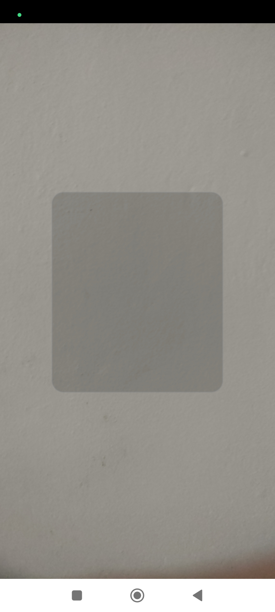
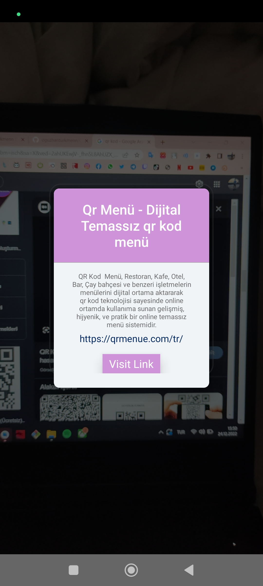

<h1 align="center">Qr Code Scanner</h1>

<h4 align="center">An app you can scan any qr</h4>

<h1 align="start">🛠 Project Features</h1>

## Screenshots

| Qr | Details | 
|-------------------|-------------------|
|  |  |

